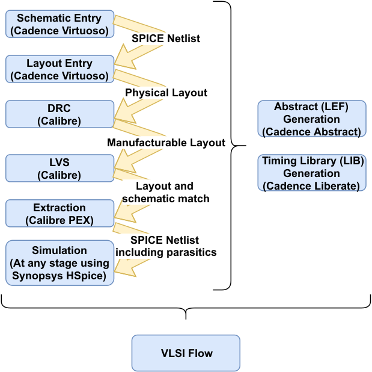
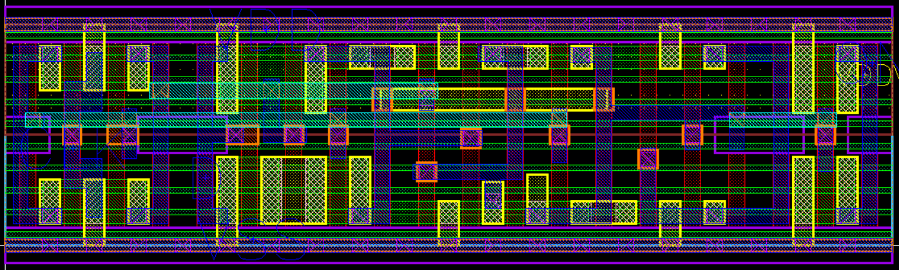

# EECS 251B Lab 4 Part 1 - Introduction to Custom Design Flow  

<p align="center">
Prof: Vladimir Stojanovic
</p>
<p align="center">
TA: Sunjin Choi, Paul Kwon
</p>
<p align="center">
Department of Electrical Engineering and Computer Science
</p>
<p align="center">
College of Engineering, University of California, Berkeley
</p>

## Overview
In the previous lab, you used the digital design flow to place-and-route a
design using a pre-existing library of standard cells based, then pushed it
through DRC and LVS. In this lab, we will walk you through the basics of custom
IC design. First, we will place-and-route a 4-16 decoder using the Hammer flow
in Chipyard. We will then extract the design and simulate both the
non-extracted and extracted netlist. With that, we can compare the timing and
energy results between pre- and post-extraction.  

Then, we will take a closer look at the ASAP7 standard cells we have been using 
throughout the course and start a custom cell design in Cadence Virtuoso. You 
will inspect a simple D flip-flop, run DRC to verify the layout is 
manufacturable, and LVS to verify that your layout matches your schematic. 
Then, you will run parasitic extraction on your design and run some basic 
simulations to estimate some of its characteristics.

<!---
The next task is to bridge the gap from designing the cells to abstracting them
in a form that the VLSI flow tools can efficiently consume and process.  For
example, synthesis and P&R tools must be able to calculate path delay without
running a Spice simulation itself, necessitating timing models. Similarly, P&R
only cares about the boundary, pins, and blockages of cells instead of the
entire transistor-level layout, necessitating layout abstracts. We will see how
to generate both types of abstractions, timing and physical, from a custom
circuit.
--->

## Getting Started: Decoder Extraction

First, pull the latest changes to the lab Chipyard repository:

```
cd chipyard
git pull
```

Notice that there is now a folder called `vlsi/lab4`. Inside, there is a 
`decoder.yml` file, which contains the Hammer inputs for the 4-16 decoder 
we will be working with (it is pretty similar to `gcd.yml` from the last lab, 
minus simulation keys).

We will need to push the decoder through the tools using the Hammer flow.
Refer to the previous lab for help on how to invoke Hammer. Synthesis, PAR, and
LVS all need to be run before you can proceed. Note that we have need to source
a lab 4 specific shell script before we can proceed. This adds all the same
things to our path as the previously used `inst-env.sh` script with a few
things added such as adding Virtuoso and Spectre to your path.

```
source scripts/inst-env-lab4.sh
cd vlsi
<invoke-hammer-here-with-lab4-inputs>
```

***Q1: Include the commands that you ran to get syn, par, and lvs
to run in your lab report. You may run `lab4-vlsi` instead of `example-vlsi` for this question***

Before continuing, examine the `lab4-vlsi` file more closely. This file 
contains a HammerDriver that extends the base HammerDriver class. This is how 
the Hammer flow allows for flexibility in the design. If you want to edit the 
default steps that Hammer runs, you can do it like this. You may add Hammer 
[hooks](https://hammer-vlsi.readthedocs.io/en/latest/Hammer-Use/Hooks.html) here
to inject custom TCL that doesn't fit into a Hammer API (any real tapeout will 
certainly have some custom TCL). You may insert hooks before or after any 
default Hammer step (or another hook), you may replace a default Hammer step, or
you may remove a Hammer step. In the `get_extra_par_hooks` method, we have 
instructed Hammer to add a `visualize_floorplan` hook, which generates a 
pictorial floorplan in `par-rundir/all.svg` (this will become more useful with 
more complicated floorplans). We also remove the `place_bumps` and `clock_tree` 
as they are not useful for this lab.

***Q2: Why do we need to remove the `clock_tree` step for this decoder?***

## PEX: Parasitic Extraction

We will be using the Calibre tool PEX to run parasitic extraction. Parasitic 
extraction will produce a netlist with more accurately modeled capacitances and
resistances for the nets in the design. We can then simulate this netlist with 
Spice to get more accurate results than just the original post P&R netlist. 
PEX will first run LVS (again) before exporting the extracted netlist.

We will start by opening up the decoder in CalibreDRV:

```
cd <path-to-build-dir>/lvs-rundir
./generated-scripts/view_lvs
```

In CalibreDRV, click `Verification` > `Run xACT...` on the toolbar.  You can
load the default ASAP7 extraction "runset" by clicking on `File` > `Load
Runset` and then selecting
`<path-to-build-dir>/tech-asap7-cache/extracted/ASAP7_PDK_CalibreDeck.tar/calibredecks_r1p7/calibre/rundirs/pex/runset_dir_pex/xactRunset_asap7`
This will point xACT to the PEX rule deck for ASAP7. Then go to `Inputs`. Click
yes when the tool asks if you want to create the run directory "pex".  For the
Layout Path, PEX should extract it from the layout of the decoder it already
has. For the Netlist, select `decoder.include.sp` in your `lvs-rundir` (make
sure "Export from source viewer" is unselected). Under `Outputs`, make sure the
Netlist Format is set to `HSPICE`. Finally, click `Run xACT`. This may take
around 30 minutes to run.

***Q3: Submit the first 40 lines of the "decoder.pex.netlist" file generated by 
PEX.***

We will now use HSPICE to simulate and compare the pre and post-extraction
decoder. HSPICE is one of the most popular and industry-standard circuit simulators 
developed by Synopsys. You will often hear about HSPICE (Synopsys) and Spectre (Cadence) being the de-facto simulators in the field.
If you are not familiar with HSPICE, here are resources you can refer to
[HSPICE Tutorial](https://inst.eecs.berkeley.edu/~ee105/sp11/tutorials/HSPICE_Tutorial.pdf) [HSPICE Manual](https://cseweb.ucsd.edu/classes/wi10/cse241a/assign/hspice_sa.pdf) to 
learn about the basic netlist syntax and simulation commands.

We have supplied some HSPICE files in `vlsi/asap7_pex` that have the
testbenches mostly setup for you already. The testbenches are
`decoder_testbench.sp` and `extracted_decoder_testbench.sp`. For the
pre-extraction simulation, first run `make hspice-netlist` in the `asap7_pex`
directory. This will generate `decoder.hspice.sp`, an HSPICE compatible
netlist, from the post-PAR verilog netlist. To run the pre-extraction simulation 
run the following command:

```
hspice -i decoder_testbench.sp
```

This should produce a number of output files including `decoder_testbench.tr0`.
This file includes the transient voltages and currents of various nodes within
the design. To view the waveforms produced by the simulation you can use the
WaveView program. Run `wv` in the terminal. Then click `File` > `Open Waveform
File...`.  Select the `decoder_testbench.tr0` file and click `Ok`. You should
now be able to click through the testbench hierarchy and add signals to the
WaveView window.

For the post-extraction simulation, make sure that the ports match up with the
instantiation of the decoder in `extracted_decoder_testbench.sp` (the port
order is somewhat random in the PEX netlisting and SPICE is sensitive to port
ordering). The files curently assume a build directory of `build/lab4`. If
your build directory is different then make sure to edit the appropriate files.
Run this simulation the same way you ran the pre-extraction testbench.

***Q4: Simulate the decoder and measure the delay from `A[3]` rising 
(the rest are 0) to `Z[8]` rising and the average power for both the 
extracted netlist and the original LVS netlist to compare them. 
State the output load capacitance you used. NOTE: The testbenches need
to be changed such that A[3] is being driven and the other inputs are
connected to GND.***

## Getting Started: Custom Design

In this portion of the lab, we will be exploring custom cell design. Figure 1 
gives an overview of the steps involved in the design flow for creating a 
custom cell and integrating it into a VLSI flow. We will import an existing 
design of a flip-flop in the ASAP7 PDK and introduce the steps you would take 
while building a custom standard cell. We will examine its schematic, export a 
netlist, run DRC and LVS, and simulate it.

<p align="center">
 
    <br><em>Fig. 1 - Custom Cell Design Flow</em></br>
</p>

Start by running the following commands to setup and run Cadence Virtuoso 
(recommended to run in the `lab4` directory to minimize file clutter).
You should then see 2 windows, a command intepreter window (CIW) and a Library 
Manager window, as shown in Figure 2.

```
cd lab4
tcsh      # start C shell
source ~eecs251b/sp23-workspace/asap7/asap7PDK_r1p7/cdslib/setup/setup_asap7.csh
exit      # exit C shell
virtuoso &
```

<p align="center">
 
    <br>
    <em>Fig. 2 - Virtuoso</em>
    </br>
</p>

In the Library Manager, you will notice that there are several libraries already
setup (in addition to the default Virtuoso libraries). `asap7_TechLib` is the 
ASAP7 library that contains the different transistor flavors available in ASAP7. 
`asap7ssc7p5t` is another library provided by ASAP7 that contains a few example 
standard cell views, including a flip flop, inverter, and tapcell. If you wanted 
to view the layouts for the other standard cells in ASAP7, you could make a new 
library by going to `File` > `New` > `Library`. Call it `asap7_std_cells`. Then 
select "Attach to an existing technology library" and choose `asap7_TechLib`.  

Then in the CIW (small window), go to `File` > `Import` > `Stream` with Stream File as 
`~eecs251b/sp23-workspace/asap7/asap7sc7p5t_27/GDS/asap7sc7p5t_27_R_201211.gds` 
and select the `asap7_std_cells` library. Attach it to `asap7_TechLib` and click 
`Apply`. This will stream in the layouts for all the existing standard cells in ASAP7.

### Creating the Custom Library

Now, create a new library by going to `File` > `New` > `Library` in the
Library Manager and name it `custom_cell`. Then select "Attach to an existing 
technology library" and choose `asap7_TechLib`. We will be exploring the 
flip-flop view that is already provided in ASAP7. In the library manager, go to
`asap7ssc7p5t` and right-click on `DFFHQNx1_ASAP7_75t_R` and click `Copy`. In 
the new window, change the To library to be `custom_cell` and the Cell to be 
`custom_dff_R`, and click Ok. This will give us a pre-made schematic, symbol, 
and layout for our "custom" cell.

### Schematic Entry

For a truly custom cell, you would create a new schematic view in your new
library and build your design using the components in the ASAP7 PDK. Once you
built it, you can simulate it to verify its operation, including Monte Carlo
simulations to test its operation with process variations.

In this case, you can open up the existing schematic that we copied over (it
should look like Figure 3). Answer the following questions about the schematic:

***Q5: What is the purpose of the tristate buffer that connects
from the "MS" node to the "MH" node (output of the input latch)?  Does this
affect the setup time? Why do these tristate transistors have fewer fins than
the input transistors?***

Notice the top level pins of the schematic.  These are the same pins that will
be the inputs and outputs of our standard cell layout.

<p align="center">
 
    <br>
    <em>Fig. 3 - Schematic of the DFF</em>
    </br>
</p>

If you want to instantiate this cell in a testbench or other schematic, you need
to create a symbol view.  We already have one in this case, but to create one
you can go to `Create` > `Cellview` > `From Cellview`, and click Ok in the
dialog box. You can leave the symbol as is, or use the drawing tools to draw
something custom. When you are done, save and close the window.

### Schematic Netlist Export

We will be running LVS/PEX against this schematic later, so we will need to
export this schematic as a netlist. Most physical verification tools perform
verification on generic filetypes, such as GDS files for layout and SPICE
netlists for schematics. To export the DFF schematic, go to `File` > `Export` >
`CDL` in the CIW, then populate the following fields:

- Library Name: Your new Custom Cell library
- Top Cell Name: `custom_dff_R` (or your top cell name)
- View Name: `schematic`
- Switch View List: `auCdl schematic`
- Stop View List: `auCdl`
- Output CDL Netlist File: `custom_dff_R.cdl`
- Make sure "Map Bus Name from <> to []" is checked.

Hit Apply and wait for the CDL to be exported, then sanity check it.

### Layout Entry

As discussed above, we will be using the existing DFF layout, so no
modifications are required for this lab.  The following instructions are a
general tutorial for basic layout editing.

<p align="center">
 
    <br>
    <em>Fig. 4 - DFF Layout</em>
    </br>
</p>

Figure 4 is a screenshot of what your copied DFF layout should look like. 
If you are unfamiliar with transistor level layout, it would be
instructive for you to go through the DFF layout and correlate parts of it to
the schematic. If you're unsure of where to start, you can use the top level
input pins (M1 pins) and the number of fins for different transistors as
references. For simple things, you only need a few commands to change the
layout:

- By pressing ~, 1, 2, 3 etc you can show only certain layers. Press
  Shift-1 to add M1 to whatever is visible. 
- To move something, hover over the object, then press "m" on the keyboard.
- To make something bigger or smaller, hover over the edge of the object, then
  press "s" on the keyboard, then click again at the final location.
- Press "Esc" if you selected something incorrectly.
- To add new wire, press Ctrl-Shift-W (then F3 will change the options such as
  the width).
- To just add a rectangle, select the desired layer in the layer pallete, and
  press "r". Then click on the two corners to create. 
- Selecting an object and hitting "q" will bring up property info about it and
  allow you to edit certain characteristics.
- "k" allows you to place rulers to measure distances in the layout.

## Cell Verification

When you are done with your schematic and layout, you can run Calibre DRC and
LVS directly from Virtuoso because there is a Calibre plugin accessible from the
toolbar included in our setup. This lets us use the same Calibre tools we ran
in the previous lab to verify our custom cell.

### DRC

To run DRC, go to `Calibre` > `Run nmDRC` in the layout editor. Select the
rule file to be `$PDK_DIR/calibre/ruledirs/drc/drcRules_calibre_asap7.rul`.
Make sure that under Inputs, "Export from layout viewer" is selected and then
Run DRC.

Like in the previous lab, you will see an RVE window with the DRC results. Your
design should be DRC clean except for a LUP error.

***Q6: Read this DRC error and explain what the error is. What is the purpose and
operation of a tapcell? You can look at an ASAP7 tapcell layout in the the same
`asap7ssc7p5t` library we copied the DFF schmatic and layout from.***

### LVS

You don't have to run LVS for this lab, but if you are building a custom cell
from scratch, you can do it similarly to DRC by going to `Calibre` > `Run
nmLVS`. Change the rule file to
`$PDK_DIR/calibre/ruledirs/lvs/lvsRules_calibre_asap7.rul`. Make sure to
select the CDL we exported earlier as the netlist.

If you are running into LVS errors, Calibre will describe the discrepancies and
allow you to highlight the offending nets just like when we ran LVS for a larger
design.

### Extraction

To run parasitic extraction, go to `Calibre` > `Run xACT...`. The settings for this
extraction are essentially the same as earlier in the lab, when you extracted
the decoder. Make sure to select the CDL we exported earlier as the netlist. 

To avoid an LVS error due to substrate pins and power pins being physically
separate at the standard cell level (this is a hint for the tapcell question),
you must select an additional option. In the xACT window, select `Options` > 
`Virtual Connect`. Make sure that the `Virtual Connect Nets` box is checked
and is set to `Specified Nets`. In the `Specified Nets Name` box make sure that 
"VDD VSS" is input. If you loaded the runset properly then you will likely not
need to change anything.

Note that when you have finished extracting and close the PEX window, ***do not
save the changes to the runset file***, otherwise the next time you run PEX,
you'll extract a previous design instead!

## Extracted Simulation

Finally, we will do a couple more simulations on the exported CDL and the
extracted netlist. You should be able to use a very similar testbench to the one
used earlier for the decoder. We have included an example spice testbench at
`asap7_pex/dff_testbench.sp` that may be useful to you. Remember
that the output of this flip flop is QN, not Q. Make sure to check the ordering
of the ports of your DFF between the different netlists.

TODO: add a paragraph

***Q7: Estimate the CLK-Q time of your DFF for both the exported CDL and
the extracted netlist from xACT. Include a screenshot (or the text) of your
spice/otherwise testbench. State the load capacitance and rise/fall times you
used.***

***Q8: Estimate the setup time of your DFF for both the exported CDL and the
extracted netlist from PEX. State the load capacitance and rise/fall times you
used. Also, include a screenshot of the waveforms of CLK, D, and QN for the
simulation that you determined the setup time from (if you're using HSPICE, you
can use WaveView or wv on the command line to load the `.tr0`
waveforms).***

***Q9: Compare your setup time result to the timing parameters for
`DFFHQNx1_ASAP7_75t_R` in
`~eecs251b/sp23-workspace/asap7/asap7sc7p5t_27/LIB/NLDM/asap7sc7p5t_SEQ_RVT_TT_nldm_201020.lib.gz`.
Copy the entire section of the lib (starting at "timing () {}") that
corresponds to the setup time and try to guess why it is presented as a look-up
table instead of a single value without consulting a LIB reference. Tip: you
can find the table units and templates at the top of the file, and then find the
timing lookup tables for clk-q, setup, etc. by searching for the
DFFHQNx1_ASAP7_75t_R entry.***


## Conclusion


This lab is part 1 of an introduction to custom design flow. What we've covered so far 
is DRC, LVS and PEX, which are the most critical elements of today's EDA flow.
At the end of every design flow, you will be running DRC to make sure your design meets the
foundry's manufacturing rules, LVS to ensure the layout matches your schematic intent, and PEX to 
verify circuit behaviors with extracted layout parasitics.
However, this is not the end of custom design flow story. If you want to incorporate these cells into
VLSI tools and generate larger-scale designs, you may need better abstractions
for the cells. Part 2 of this lab will explore Cadence Abstract Generator (for LEF) and Cadence
Liberate (for LIB), which generates layout and timing abstractions for custom cells.

<!---
This lab was meant to give a fairly comprehensive overview of the custom design
flow. You now know how to generate all of the required collateral for the VLSI
tools for both a standard cell and a bigger custom cell. You learned how to
use Cadence Abstract Generator (to create the LEF) and Cadence Liberate (to
create the LIB) in detail, which may come in handy for your projects if you
need to rapidly characterize and abstract custom cells.

As described, there are still multiple characterizations that we have not
explored in depth, such as power, leakage, electromigration, antenna, and more.
We have also not taken into account process variation in the characterization
results. These are left for you to explore for your projects or future
research.
--->

## Acknowledgments
Thank you to Erik Anderson who updated the lab for EECS251B.
This lab was originally written by Harrison Liew,
Daniel Grubb, Sean Huang, and Brian Zimmer. Additionally, we'd like to
recognize ECE 6332 - Introduction to VLSI Design (for the 21st Century) at UVA
for the excellent ASAP7 layout reference.
