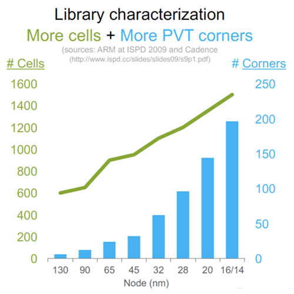
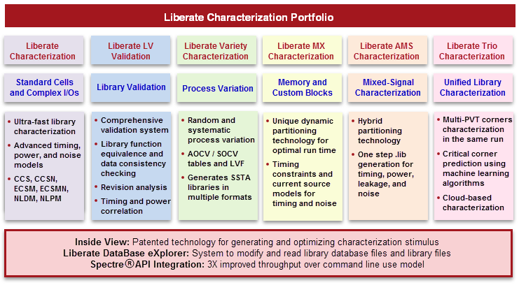
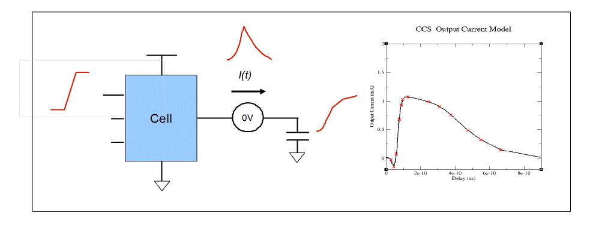
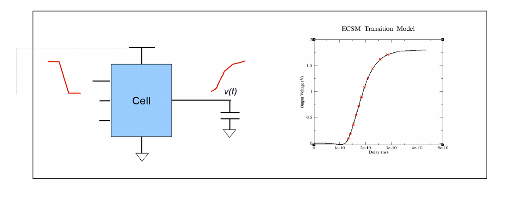
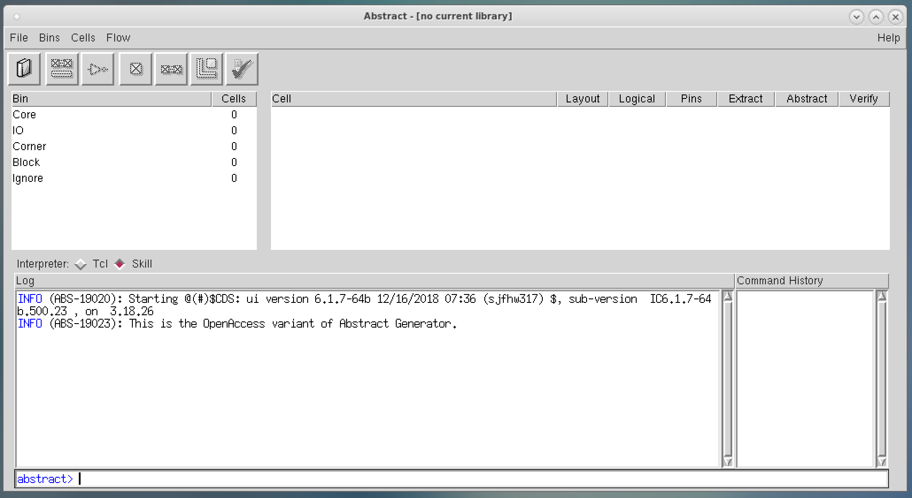
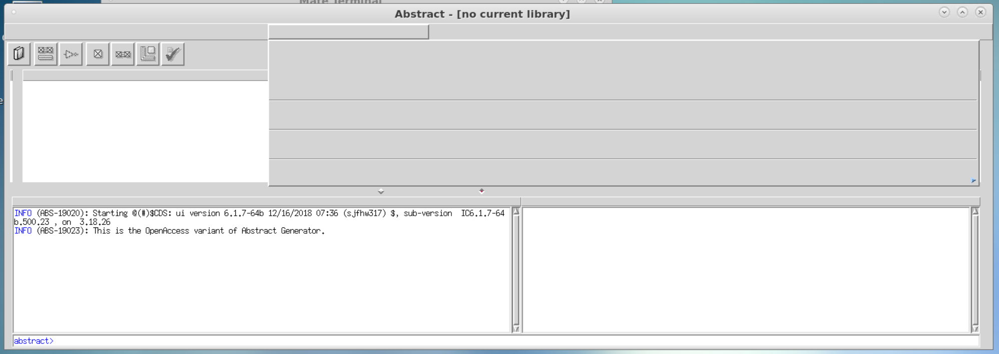
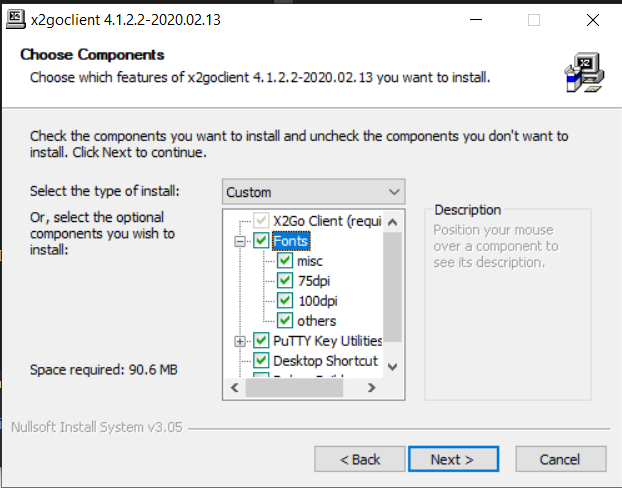

# EECS 251B Lab 4 Part 2 - Introduction to Custom Design Flow  

<p align="center">
Prof: Vladimir Stojanovic
</p>
<p align="center">
TA: Sunjin Choi, Paul Kwon
</p>
<p align="center">
Department of Electrical Engineering and Computer Science
</p>
<p align="center">
College of Engineering, University of California, Berkeley
</p>

## Overview

In the previous labs, you used the digital design flow to place-and-route a 
design using a pre-existing library of standard cells based, then pushed it 
through DRC and LVS. In Part 1 of this lab, you learned how to extract the 
custom digital design and simulate both the non-extracted and extracted netlist.
With that, we can compare the timing and energy results between pre- and post extraction.
Additionally, you learned how to inspect a simple D flip-flop schematic and layout, 
run DRC to verify the layout's manufacturability, and run LVS to verify that your layout matches
your schematic.

The next task is to bridge the gap from designing the cells to abstracting them
in a form that the VLSI flow tools can efficiently consume and process.  For
example, synthesis and P&R tools must be able to calculate path delay without
running a Spice simulation itself, necessitating timing models. Similarly, P&R
only cares about the boundary, pins, and blockages of cells instead of the
entire transistor-level layout, necessitating layout abstracts. We will see how
to generate both types of abstractions, timing and physical, from a custom
circuit.


## Characterization and Abstraction in the Custom Design Flow

In real PDKs, the standard cell library consists of many more cells than a
single flip-flop.  Each of these cells have different functions and therefore
different timing parameters beyond setup time.  Furthermore, it is important to
know how much power each cell consumes, so that the synthesis and P\&R tools can
minimize overall power consumption. This is all compounded by the fact that
libraries must be characterized at multiple operating conditions (process,
voltage, and temperature), which at the very minimum need to support setup and
hold time calculations.  With ever-increasing complexity and end-applications,
successively smaller CMOS nodes have required characterizing an exponentially
larger set of cells and operating conditions, as shown in Figure 5.

In the following sections, we will generate Liberty Timing Files (LIBs) and Library Exchange
Format files (LEFs), the two main abstraction collaterals for the VLSI flow.  We
will also generate the remaining pieces of collateral needed for the VLSI flow
and see how this is applicable to not only the standard cells, but also
non-digital blocks (such as analog IP) that need to be integrated into a design.

<p align="center">
 
    <br>
    <em>Fig. 1 - Exponential Growth in Library Characterization</em>
    </br>
</p>

## Cadence Liberate: Characterization

Cadence Liberate is a tool that can analyze the function of any circuit and
output "electrical views", which contain all the relevant timing relationships
between pins, the power consumption information, and more. It accomplishes this
by intelligently finding timing arcs, setting up Spice simulations, and
measuring parameters like delay and currents automatically, thereby vastly
improving the time it takes to prepare a cell for the digital VLSI flow.

A summary of all the things that various Liberate tools can characterize is
shown in Figure 6, which is taken from the reference manual at
`/share/instsww/cadence/LIBERATE/doc/liberate/liberate.pdf`.  In this lab, we
will only use Liberate Characterization to generate LIBs for our flip-flop.

<p align="center">
 
    <br>
    <em>Fig. 2 - The Complete Cadence Liberate Suite</em>
    </br>
</p>

### LIB Files

Liberty Timing Files (LIBs) are an IEEE standard. A very high-level
introduction of the key parameters and format of the standard is described
[here](https://redirect.cs.umbc.edu/~cpatel2/links/641/slides/lect05_LIB.pdf)
which corresponds to a basic timing model called the Non-Linear Delay Model
(NLDM). It is a simple lookup table-based model which describes delays and
rise/fall times for various input waveforms and output loads that results in
small LIB files at a moderate accuracy loss compared to a Spice simulation.

With deeply-scaled technologies, however, switching events actually generate
significant transient current and voltage spikes, which can cause glitching on
critical and neighboring nets. As a result, additional LIB models are needed to
accurately model these effects, namely Composite Current Source (CCS) and
Effective Current Source Model (ECSM), which non-linearly sample the output
current and voltage waveforms, respectively, and are shown in Figs 7 and 8. CCS
models are generally used for Synopsys VLSI tools (Design Compiler, IC
Compiler), while ECSM models are generally used for the Cadence tools that we
have used so far.

Finally, there are additional things to characterize: power, noise immunity, signal integrity, process variation, and electromigration. Liberate will by default analyze power and its importance is self-explanatory, but the latter few are used to ensure product reliability. You will learn about these in lecture but they are outside the scope of this lab. 

<p align="center">
 
    <br>
    <em>Fig. 3 - Composite Current Source Model</em>
    </br>
</p>

<p align="center">
 
    <br>
    <em>Fig. 4 - Effective Current Source Model</em>
    </br>
</p>

### Generating LIBs

First, navigate to `vlsi/asap7_lib`. Inside, there are a few TCL files and a
Makefile. Let's go through them one-by-one to see how Liberate works in order
to characterize our "custom" flip-flop. We will also then compare it against
the LIB that comes from the PDK, which is located at
`~eecs251b/sp23-workspace/asap7/asap7sc7p5t_27/LIB/NLDM/asap7sc7p5t_SEQ_RVT_TT_nldm_201020.lib.gz`.

The Makefile is very simple. You can see that `CELL_TYPE` is set to `DFF`,
which passes `char_DFF.tcl` to the `liberate` command. This TCL file is set up
for characterizing D flip-flops.

`char_DFF.tcl` is divided into a few short sections:
1. It sources a template file `template_asap7.tcl` that we will look at
   next.
2. You then choose between 3 PVT corners: `TT_0p7V_25C`, `SS_0p63V_100C`, and
   `FF_0p77V_0C`. These PVT corners correspond to the corners that were
   characterized by the developers of the ASAP7 PDK. The relevant ASAP7 Spice
   transistor model file is selected based on the process corner.
3. You then specify the names of the D flip-flops that you want to characterize
   for this LIB, read the PEX netlists for those cells, and define I/O and
   template parameters of this cell family, which denotes that `CLK` is the
   clock port, `D` is an input port, `QN` is the output port, and some
   delay/constraint/power templates (see below).
4. Finally, the cells are characterized at the chosen PVT corner and written to
   a `.lib` file.

`template_asap7.tcl` sets some base units and a bunch of variables and
templates that are actually generated from the source LIB for the flip-flip we
are analyzing (`DFFHQNx1_ASAP7_75t_R`). Here's what the variables
mean (summarizing from the reference manual):
- `(measure_)slew_lower/upper_rise/fall`: Together, these 8 variables pass
  through to the output LIB and tell Liberate that output transition time
  values are measured between 10% to 90% of the supply voltage.
- `delay_inp/out_rise/fall`: Together, these tell Liberate to measure the delay
  from an input to output for both edges at the 50% of supply voltage point.
- `def_arc_msg_level` and `process_match_pins_to_ports`: These tell Liberate to
  throw an error if no valid arcs are found and if the pin list is incorrect.
  This can help detect an mismatched `define_cell` command setup relative to
  the cell being characterized.
- `max/min_transition`: These get encoded in the LIB as a min/max bound for
  transition times on any pin. These values are passed onto synthesis and P\&R
  to prevent them from sizing driving cells and loads too large or small.
- `min_output_cap`: This sets the minimum output load during the
  characterization simulations.
- `define_template -type delay`: This is a table for delay characterization for
  various values of input slew (`index_1`) and output load
  (`index_2`). It is named `delay_template_7x7` which the delay
  tables will refer to in the generated LIB.
- `define_template -type constraint`: This is a table for timing constraint
  (setup, hold, etc.) characterization. Here, `index_1` is a range of input
  slews on the data and `index_2` is a range of input slews of the reference
  signal (clock, reset, etc.).
- `define_template -type power`: This is a table for switching and internal
  power consumption. Here, `index_1` is a range of input slews and `index_2` is
  a range of output loads.

For more information about LIB syntax, you would find the [Liberty Reference Manual](https://people.eecs.berkeley.edu/~alanmi/publications/other/liberty07_03.pdf) useful.

***Q1: What is the benefit of specifying min/max transition times? Hint:
think about signal integrity and crowbar currents.***

***Q2:The template tables are optimized for a `DFFHQNx1_ASAP7_75t_R`
cell, which is the smallest available D flip-flop. For larger D flip-flops
(i.e. larger internal transistors and output drive strengths), are the provided
template tables suitable? If not, which tables might we want to change and how?
To verify your hypothesis, check against the PDK's LIB.***

Now, let's generate the LIB. Copy or symlink the PEX netlist for your
flip-flop from earlier into this `asap7_lib` folder. Then, run:

```
make gen-libs
```

After a couple minutes, it will output a `DFF_<PVT corner>.lib` file, as
well as a log a file. Open up the generated LIB to compare against the PDK's
LIB, then answer these questions:

***Q3: Glance through the two LIBs and note any high-level differences between
the characterization results of your flip-flop and the PDK's
`DFFHQNx1_ASAP7_75t_R`.***

***Q4: Repeat the characterization for the PVT corners that would be used for
setup and hold analysis (which corners are these, respectively?). Show some
general comparisons of setup/hold timing and active/leakage power between these
LIBs and the typical PVT corner LIB we generated first.***

## Cadence Abstract: Layout Abstracts

Cadence Abstract is a tool attached to Virtuoso that generates a layout
abstraction for P&R tools. An abstract is a high-level representation of a
layout view, containing information about the type and size of cells, positions
of pins, and the size and type of blockages. These abstracts are used in place
of full physical layouts so that P&R tools can have better performance. In the
P&R process, only the bare minimum information is needed for it to know where
it is allowed to place cells and how to route to them; extracting this
information from the full layouts would consume excess resources. Finally, if
you want to integrate some IP into your chip, whether it is SRAM, data
converters, etc., abstracts are a way to keep everything inside the IP as a
blackbox from the perspective of the physical design flow. 

A summary of the Abstract tool and instructions are found in the documentation
at `/share/instsww/cadence/IC617/doc/abstract/abstract.pdf`. If you are going
to generate more complex abstracts for your project, this is very important to
reference. In this lab, we will use Abstract to generate LEFs for our
flip-flop.

### LEF Files

Library Exchange Format (LEF) is an open industry standard that was developed
by a company that has since been acquired by Cadence. It is an ASCII text
format and is often used in conjunction with the very similar Design Exchange
Format (DEF) files in order to fully describe abstract layouts. An introduction
to LEF can be found
[here](https://www.csee.umbc.edu/courses/graduate/CMPE641/Fall08/cpatel2/slides/lect04_LEF.pdf)
and the full LEF/DEF Language Reference Manual can be found at
`/share/instsww/cadence/IC617/doc/lefdefref/lefdefref.pdf`.

In general, VLSI tools need to take a set of abstracts that in aggregate
describe the basic technology rules and information about all macros to be
used. In the LEF specification, technology rules are specified in a technology
LEF that will contain definitions of layers, manufacturing grids, vias, and
sites (i.e. the standard cell unit height/width). Macro information is
specified in separate LEFs that contain definitions of class (type of cell),
size, symmetry, pins, and obstructions (i.e. areas not available for routing).
We will now explore how to generate the latter type of LEF.

### Generating LEFs

Run the following command in the Virtuoso directory that we created earlier:

```
abstract &
```

When you open Abstract GUI, it should look like this:

<p align="center">
 
    <br>
    <em>Fig. 5 - Correctly Displayed Abstract</em>
    </br>
</p>


Be advised that Abstract is quite an old tool, and may display like this in
your X2Go session, where a lot of the menu text is invisible:

<p align="center">
 
    <br>
    <em>Fig. 6 - Incorrectly Displayed Abstract</em>
    </br>
</p>

There are 2 possible solutions. The first is to shutdown your existing X2Go
session and re-install your X2Go with all legacy fonts, as shown here for a
Windows installer:

<p align="center">
 
    <br>
    <em>Fig. 7 - Selecting Legacy Fonts in X2Go Installer</em>
    </br>
</p>

The other solution is to rely solely on X11 forwarding over an SSH terminal,
which may be slow and cause you to lose your work if the connection drops.

Take a look at the toolbar buttons -- these correspond to the steps needed to
generate an abstract. We are going to go through them from left to right:

1. Click the Library button (looks like a book). Select the Virtuoso library
   that contains your custom DFF. You should see that the `custom_dff_R` cell
   appears on the right pane -- click on it. You should also see 1 cell in the
   `Core` "bin" on the left pane. The bins correspond to the types of cells
   that the LEF specification defines; for a standard cell that we have it
   should be in the `Core` bin, but for things like larger IP blocks, you would
   want them in the `Block` bin.  To do this, you would select the cell, go to
   `Cell` > `Move`, and select the destination bin.

2. Click the Layout button (looks like 2 wires and 2 vias). This is used to
   import a layout from a GDS file, such as if somebody else gave you a
   finished layout in GDS format and not as a Virtuoso library. Since our
   flip-flop already has a layout view in Virtuoso, we can hit Cancel out of
   this dialog box.

3. Click the Logical button (looks like an inverter symbol). This tells the
   tool what the pins are. Since we just generated a LIB, select LIB as the
   Filetype and browse to the LIB you created just now. For other cells, we can
   also import Verilog shell instead, which would just define the module and
   ports but does not need implementation.

4. Click on the Pins button (a square with an X inside). This is where we
   select options for how to extract pin shapes from the pin labels in the
   layout view and pin directions from the logical view. There are 4 tabs: Map,
   Text, Boundary, and Blocks.
   
   - In the Map tab, under the field "Map text labels to pins", type
     `(M1 M1) (M2 M2) (M3 M3) (M4 M4) (M5 M5) (M6 M6) (M7 M7) (M8 M8)
     (M9 M9) (Pad Pad)`. This means that all pin labels on each layer
     are mapped to shapes on the same layer. Leave the other fields
     as-is.
   - In the Text tab, do not change anything. However, this can be used if you
     want to use regex to change the pin names between the layout and abstract
     view (e.g. bus bit designators).
   - In the Boundary tab, do not change anything. Here, the listed layers will
     designate the rectangular P&R boundary of the cell we want to extract.
     With the "as needed" option, it will create a boundary only if a
     `prBoundary` shape is not defined in the layout view. Other designs
     may want to restrict the layers used.
   - In the Blocks tab, do not change anything. This is only used to process
     pre-routed layouts that are imported from a DEF file.
  
    Now, click Run. The abstract log should tell you that 5 pins have been
    created.

5. Click on the Extract button (like the Layout button without the wire
   underneath). This is used to trace the connectivity between shapes and
   terminals, and also generate antenna data. There are 4 tabs: Signal, Power,
   Antenna, and General. You do not need to change anything in any tab. In the
   first 3 tabs, for each layer, there exists a "Geometry Specification" field.
   For advanced usage, you can generate Boolean functions of multiple layers to
   define connectivity layers. Here are some other pointers for advanced usage
   later on:
  
   - Must connect pins are for situations where the same pin name exists in
     disjoint locations (i.e. not internally connected), and must be connected
     together in P\&R, which recognizes the `MUSTJOIN` specification.
   - Antenna extraction is necessary for larger blocks with pins that have long
     wires. This information is used for P\&R to decide whether it needs to do
     things like switch layers to avoid antenna violations. This is beyond the
     scope of this lab.
   - The layer connectivity list in the General tab is very important to get
     right. By default, this is filled in correctly and lists the via layers
     that join adjacent metal layers.
  
   Now, click Run. The abstract log should tell you that all 5 nets have been
   extracted.
  
6. Click on the Abstract button (square nestled in an L-shape route). This step
   adjusts pins and creates blockages, overlaps, and grids. There are 7 tabs:
   Adjust, Blockage, Density, Fracture, Site, Overlap, and Grids.
   
   - In the Adjust tab, do not change anything. However, for larger designs
     (such as analog blackboxes), you will often want to select the "Create
     boundary pins" option to confine the generated pin shape to a square
     abutting the P\&R boundary rather than over the entire block (prerequisite
     is that all pins are routed to the edge of the boundary).
   - In the Blockage tab, we encode how shapes on various layers turn into
     blockages. For this flip-flop, do not change anything; however, for larger
     designs (such as analog blackboxes), this is a very important tab.
     There are 3 types of blockages that can be generated for each layer:
     detailed, shrink, and cover. `Detail` generates a blockage shape
     for every piece of geometry on that layer -- this is useful only for
     standard cells and the topmost layers of large blocks. `Shrink`
     fills in the smaller, less useful spaces between shapes, which would allow
     for over-the-cell routing without modeling each obstruction in detail.
     `Cover` generates an obstruction covering the entire block for that
     layer, which is used for layers which should be off-limits for the P\&R
     tool. In general, you want to cover as much of your block as necessary,
     and only expose in shrink or detail the layers that are available for P\&R
     to do routing on. This both increases the efficiency of P\&R and reduces
     the chances that routing will cause DRC/LVS issues with the abstracted
     block. In the extreme case, analog IP with structures like inductors at
     the top-level need to cover block all layers, exposing only boundary pins.
     Additional advanced options in this tab will generate cutouts around pins
     and create routing channels on cover block layers.
   - In the Density tab, do not change anything. This is used to encode density
     information, which is particularly helpful to help automatic fill tools
     achieve required min/max density without needing to calculate it from the
     full layout of any blackboxes.
   - In the Fracture tab, do not change anything. This is used to fracture pins
     and blockages from polygons to rectangles if required for certain P\&R
     tools.
   - In the Site tab, for the site name, select `coreSite`. This is
     required for cells in the `CORE` bin like our flip-flop in order to
     tell the tool that it belongs to the `coreSite` site, like for all
     standard cells that need to be placed in ordered rows. For other types of
     cells, do not do this.
   - In the Overlap tab, do not change anything. This is particularly useful
     for larger designs where you want to generate a second, more detailed
     boundary that is a rectilinear polygon. This overlap layer can be
     generated from specific layers and will be used to test if cells truly
     overlap when in P\&R they are placed with overlapping boundaries.
   - In the Grids tab, do not change anything. This is a tool to help check if
     all geometry (wires and pins) are properly on the manufacturing grids,
     which is useful for standard cells but less so for larger designs. Our
     flip-flop is already fine, so we can skip this tool.
   Now, click Run. The abstract log should tell you that blockages are created
   for each layer and do a power rail analysis.
  
7. Finally, click the Verify button (it has a check mark). This step helps you
   check your abstract against rules and various P&R tools. Cancel out of this
   step, as we will just move onto generating the LEF.

***Q5: Why do we generally only want to generate pin shapes on metal layers,
and not layers such as n-well and p-substrate?***

***Q6: Say we want to abstract an SRAM block with signal and power pins on M4 and
all internal routing on M4 and below. For which layers should we generate
cover, shrink, and detailed blockages? Should we create boundary pins for
signal and/or power nets?***

***Q7: Why are there minimum and maximum density requirements for every layer
in a technology stackup?***

***Q8: Read the Overlap Tab section in the manual and explain the Overlap layer. 
Provide a simple drawing of a case where creating an Overlap layer
would be beneficial (Hint: During the placement optimization phase, P&R tools detect
cell boundaries and their overlaps and penalize any overlaps).***


Finally, we are ready to export the LEF. Go to `File` > `Export` > `LEF`. In
the window that appears, set the LEF filename to `custom_dff_R.lef` (or
something else of your choosing). Select 5.8 as the LEF version, then hit OK.

Now, open the LEF you just created alongside the LEF provided in the PDK at
`~eecs251b/sp23-workspace/asap7/asap7sc7p5t_27/LEF/scaled/asap7sc7p5t_27_R_4x_201211.lef`.
In the latter file, scroll down to the part that starts with 
`MACRO DFFHQNx1_ASAP7_75t_R`. As you compare the two files, note that the LEFs
provided in the PDK have been manually scaled up by 4x in order to get around
needing extra sub-20nm Innovus licenses.

***Q9: Minus the scaling factor, would the the abstract of the flip-flop we just
generated fit properly in the `coreSite` site, which is 1.08um tall (4x scaled
dimension)? If not, why (hint: look at the layout), and what would we need to
change when generating the abstract?***

***Q10: Notice how for the `CLK` pin it says `USE CLOCK` for our LEF while in
the PDK's LEF it says `USE SIGNAL`. How did our abstract run know it's a clock
pin, and what would we do differently to make it just a signal?***

***Q11: The `OBS` section contains our detailed obstructions. What would it look like
if instead we did COVER for layer M2? Why would this pose problems for us in
P&R? What about COVER for layer V1?***

All the the steps we took in the Abstract GUI have actually been recorded for
us. In the directory of the library containing the flip-flop, there is a
`.abstract.options` file. This file contains all of the options corresponding
to the current state of our Abstract GUI after all of our changes. In the
directory in which you launched Abstract, there is a `abstract.record` file.
This file contains the commands corresponding to the steps we took. In the
future, you can take and modify these two files in order to run Abstract from
the command line (see the section "Log, Replay, and Record File Behavior" in
the Abstract user guide).

Finally, in the Virtuoso library, for the `custom_dff_R` cell, there is now an
`abstract` view. We can open this in the Virtuoso layout editor!

***Q12: Submit a screenshot of the abstract view of the flip-flop, as viewed in
Virtuoso.***

## Remaining Views

So far, we have learned how to generate the Spice netlist (CDL), LIB, and LEF
of custom designs. The remaining important views are the Verilog netlist (for
synthesis and simulation) and the full layout GDS, for merging into the final
layout.

### Verilog

There are two cases where Verilog is used. The first is for synthesis, which
are just wrappers and are needed for blackboxes (e.g. SRAMs, analog IP). This
can be generated using Liberate with the `write_top_netlist` command (see the
manual or type `help write_top_netlist` for details). More often, it is done
manually in your source netlist, since only the port list needs to be defined.

The second case is for simulation. This Verilog file would describe the
behavior of the design, and is often hand-written along with your design during
functional verification.

### GDS

This can be generated from Virtuoso. In the CIW, go to `File` > `Export` >
`Stream`. Then, select the `layout` view of the cell to export, change the
Stream File name if desired, and select `asap7_TechLib` as the Technology
Library. Hit `Translate` and it will generate a GDS file.

### Adding an Extra Library in Hammer

To ensure that the Hammer flow knows about our new custom cell, we would need
to append to the list of `vlsi.technology.extra_libraries`. An example is found
in the `vlsi/example-asap7.yml` file in your Chipyard repository, starting on
line 85 and reproduced here for a dummy DCO. To round it out for the whole
flow, you would also include `spice netlist` for LVS, `verilog synth` for
synthesis (if not already included in your source Verilog), and `verilog sim`
for simulation.

```yaml
vlsi.technology.extra_libraries_meta: ["append", "deepsubst"]
vlsi.technology.extra_libraries:
  - library:
      nldm liberty file_deepsubst_meta: "local"
      nldm liberty file: "extra_libraries/example/ExampleDCO_PVT_0P63V_100C.lib"
      lef file_deepsubst_meta: "local"
      lef file: "extra_libraries/example/ExampleDCO.lef"
      gds file_deepsubst_meta: "local"
      gds file: "extra_libraries/example/ExampleDCO.gds"
      corner:
        nmos: "slow"
        pmos: "slow"
        temperature: "100 C"
      supplies:
        VDD: "0.63 V"
        GND: "0 V"
  - library:
      nldm liberty file_deepsubst_meta: "local"
      nldm liberty file: "extra_libraries/example/ExampleDCO_PVT_0P77V_0C.lib"
      lef file_deepsubst_meta: "local"
      lef file: "extra_libraries/example/ExampleDCO.lef"
      gds file_deepsubst_meta: "local"
      gds file: "extra_libraries/example/ExampleDCO.gds"
      corner:
        nmos: "fast"
        pmos: "fast"
        temperature: "0 C"
      supplies:
        VDD: "0.77 V"
        GND: "0 V"
```

## Conclusion

This lab was meant to give a fairly comprehensive overview of the custom design
flow. You now know how to generate all of the required collateral for the VLSI
tools for both a standard cell and a bigger custom cell. You learned how to
use Cadence Abstract Generator (to create the LEF) and Cadence Liberate (to
create the LIB) in detail, which may come in handy for your projects if you
need to rapidly characterize and abstract custom cells.

As described, there are still multiple characterizations that we have not
explored in depth, such as power, leakage, electromigration, antenna, and more.
We have also not taken into account process variation in the characterization
results. These are left for you to explore for your projects or future
research.

## Acknowledgments
Thank you to Erik Anderson who updated the lab for EECS251B.
This lab was originally written by Harrison Liew,
Daniel Grubb, Sean Huang, and Brian Zimmer. Additionally, we'd like to
recognize ECE 6332 - Introduction to VLSI Design (for the 21st Century) at UVA
for the excellent ASAP7 layout reference.
